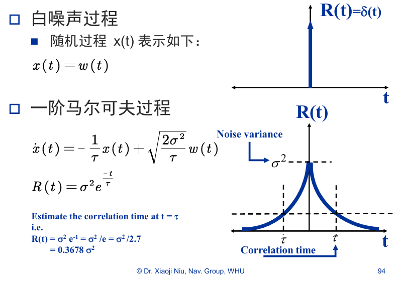
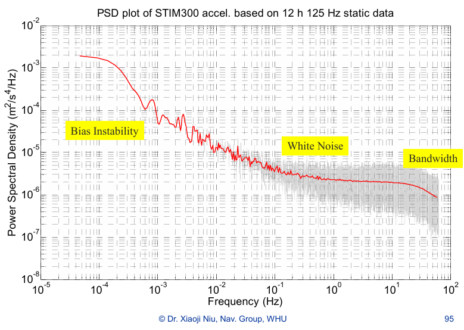
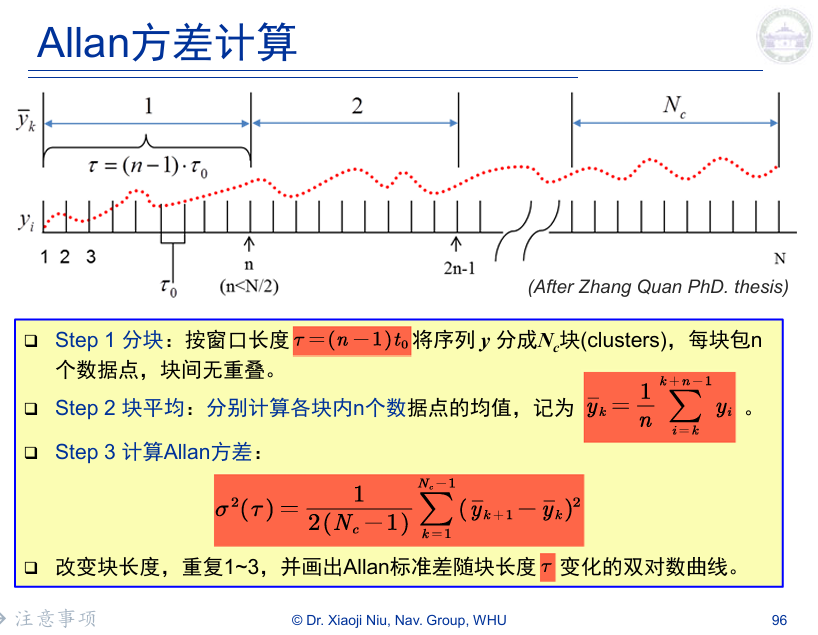

课程链接 [第05讲B IMU误差模型_哔哩哔哩_bilibili](https://www.bilibili.com/video/BV1nR4y1E7Yj?spm_id_from=333.788.videopod.episodes&vd_source=0ecf80afdba926bd66e4203eb7017f51&p=10)

---
## 1.两种测量模型
#### 1.1 加速度计的测量值
$$\tilde{f} = f + b_f + S_1 f + S_2 f^2 + N f + \delta g + \varepsilon_f$$
##### 参数说明
- $\tilde{f}~$​ ：测量值（m/s²）
- $f$  ：真实比力（m/s²）
- $b_f$ ：加速度计零偏（m/s²）
- $S_1$ ：线性比例因子误差矩阵
- $S_2$​ ：非线性比例因子误差矩阵
- $N$ ：交轴耦合矩阵
- $\delta g$ ：重力异常
- $\varepsilon_f$ ：加速度计传感器噪声（m/s²）

#### 1.2 陀螺仪的测量值
$$\tilde{\omega} = \omega + b_\omega + S\omega + N\omega + \varepsilon_\omega$$
##### 参数说明
- $\tilde{\omega}~$ ：测量值（deg/hr）
- $\omega$  ：真实角速度（deg/hr）
- $b_\omega$ ：陀螺零偏（deg/hr）
- $S$  ：陀螺比例因子误差矩阵
- $N$ ：陀螺交轴耦合误差矩阵，通常是因为轴不完全垂直等原因，一个轴的加速度影响另一个轴。
- $\varepsilon_\omega​$ ：噪声（deg/hr）

> [!NOTE]
> - **零偏**即传感器在没有输入时仍然输出的值，是一个较为重要的误差。
> - **重力异常 $δg$** 指被测物体的重力出现了不符合椭球模型的异常，按理说属于建模过程中的误差，不应归属于传感器误差，但是把它放在这里从数据处理角度来看处理起来较方便，这样我们在对传感器分析时就可以直接使用椭球模型了。
> - **为什么有非线性误差？** 推测是历史原因。因为惯导器件常用于武器系统，追求“快准狠”，因此加速度一般都很大，加速度计的量程也需要更大，量程大就容易出现非线性误差。
> - **重力异常和非线性误差**在中低精度的加速度计上可忽略。

---
## 2.术语解释
由于历史原因，惯性导航领域的术语并没有完全统一，不同文献或厂商可能使用不同表述，因此需要特别注意区分。

#### 2.1 易混淆的概念

| 概念          | 中文表述   | 描述                    |
| ----------- | ------ | --------------------- |
| Bias        | 零偏     | 静止时仍然存在的输出            |
| Bias error  | 零偏误差   | 零偏与真实值之间的偏差           |
| SF          | 比例因子   | 输入与输出之间的比例关系          |
| SF error    | 比例因子误差 | 实际比例因子与理想比例因子的偏差      |
| Random Walk | 随机游走   | 随机噪声积分后产生的累积漂移过程      |
| White Noise | 白噪声    | 各时刻互不相关、功率谱密度为常数的随机噪声 |

#### 2.2 同义词

| 术语          | 含义   |
| ----------- | ---- |
| Drift       | 漂移   |
| variation   | 变化   |
| instability | 不稳定性 |
| stability   | 稳定性  |

| 术语 | 含义 |
|----|----|
| Non-orthogonality | 轴不正交 |
| Cross-axis | 交轴耦合 |
| Axis misalignment | 轴安装误差 |
👆三个词通常描述**IMU三个轴不完全正交导致的误差**

#### 2.3 易混淆的单位
##### 加速度计单位

| 单位    | 含义                  |
| ----- | ------------------- |
| m/s²  | 标准SI单位              |
| g     | 重力加速度               |
| mg    | 毫重力                 |
| μg    | 微重力                 |
| mGal  | 毫伽（1 Gal = 1 cm/s²） |
| m/s/h | 加速度漂移单位             |

>[!warning]  
> 重力 **g 严格意义上不能作为一个标准单位**，因为不同地点的重力大小不同。  
> 只有在描述传感器精度时可以使用，**在计算中不能使用它作为单位！**

##### 陀螺仪单位

| 单位    | 含义            |
| ----- | ------------- |
| rad/s | 国际单位          |
| deg/s | 每秒角度          |
| deg/h | 每小时角度（惯导常用单位） |
##### 白噪声 / 随机游走的单位

白噪声通常以**谱密度形式**表示。

| 单位 | 含义 |
|----|----|
| rad/s/√Hz | 陀螺角速度噪声密度 |
| deg/s/√Hz | 同上 |
| deg/√h | 陀螺角度随机游走 |
| m/s²/√Hz | 加速度噪声密度 |
| μg/√Hz | 加速度计常用单位 |

> [!NOTE] 测量陀螺上电零偏的3种指标
> - 均方根RMS（最“漂亮”，有一定误导性）
> - 最大幅值
> - 峰峰值P-P（最负责，一些老牌军工企业常用）

---
## 3.误差模型

> [!NOTE]
> - 不稳定性可用发散的随机游走描述，但是随机游走理论上是无限发散的，有时候不适用于有限发散的过程，于是引入一阶高斯马尔可夫过程（变化快慢和幅度通过参数可调）
> - 随机常数是不确定的常值误差。

---
## 4.识别方法
![[误差模型的识别与参数确定方法.png]]
自相关分析与PSD是通用方法。
Allan方差是导航领域的一种**特有**的工具。

#### 4.1 自相关

- **白噪声**相邻时刻不相关，即在任何不等于0的时刻相关性为0。图中展示的是理论模型，实际多多少少还是有一点相关性的。
- **一阶马尔可夫过程**是一个有一定宽度的峰，相关时间τ反应该过程变化的快慢（宽度范围的长短）。

#### 4.2 PSD

- 最开始的斜坡对应零偏不稳定性。
- 后半部分为白噪声在功率谱上表现为先平直后衰减。
- 以上均可从PSD上辨认出具体参数。

> [!Tip]
> PSD主要用于分析中高频噪声特性，而惯性导航更关注低频漂移，因此PSD不那么适用于惯导领域。

#### 4.3 Allan方差（重点）
应用于不同场景的惯性器件关注的时间尺度不同，需要一种工具把这些不同尺度的漂移分门别类地表现出来（类似于频谱分析仪，只不过是在时间尺度）——Allan方差。

Allan方差可以反应不同时间尺度上误差序列不确定性的大小。

> [!example]
> 假设N=1h，我们关注的是时间尺度为5min，求解Allan方差:
> 1.  以5min为单位把总的1h序列划分成块；
> 2. 算出每个5min块内的均值；
> 3. 相邻块均值求差，求差值序列的RMS值。
> 4. 改变块的长度，可以得到Allan方差曲线。

个人思考：Allan方差的计算过程在形式上类似于一种滑动窗口统计，可以看作为**一种时间尺度上的“频谱分析工具”。**