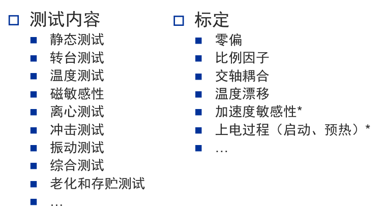

课程链接[第06讲A IMU误差测试与标定_哔哩哔哩_bilibili](https://www.bilibili.com/video/BV1nR4y1E7Yj?spm_id_from=333.788.videopod.episodes&vd_source=0ecf80afdba926bd66e4203eb7017f51&p=11)

---
## 测试与标定
测试即考察，越全面越好。
标定是测量系统性误差从而进行补偿。
标定后进行测试，得到的结果更好。

所有系统误差都可以进行补偿，但通常只需要重点考虑主要的误差。  
部分随机误差可以通过导航算法进行估计，并在系统运行过程中进行在线补偿。

*加速度敏感性：*
